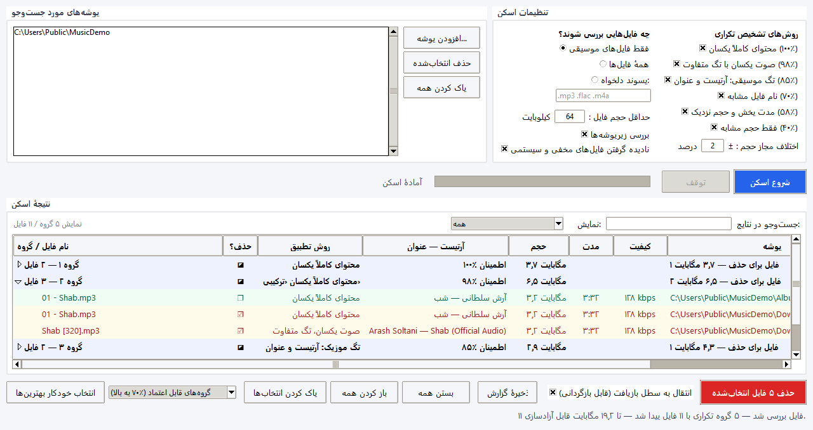

<div align="center">


# حذف‌کنندهٔ فایل تکراری

**پیدا کردن فایل‌های تکراری — بخصوص آهنگ‌های تکراری — حتی وقتی فایل‌ها نه نام
درستی دارند نه تگی.**

[English](README.md) · **فارسی**

</div>

---

<div dir="rtl">

## مسئله‌ای که حل می‌کند

پوشهٔ موسیقی‌ای که چند بار ادغام و دوباره دانلود و بکاپ شده، آخرش یک آهنگ را
چند بار دارد. برنامه‌های معمولیِ پیدا کردن تکراری، حجم یا هشِ کل فایل را
مقایسه می‌کنند و روی موسیقی مدام شکست می‌خورند:

- یک آهنگ که دو بار با تگ‌های متفاوت ذخیره شده، **بایت‌ها و حجمش فرق می‌کند**.
  مقایسهٔ هش می‌گوید این دو هیچ ربطی به هم ندارند.
- فایل‌ها با نام‌هایی مثل `track_0001.mp3` یا `00000123.mp3` می‌رسند و مقایسهٔ
  نام چیزی برای کار کردن ندارد.
- تگ‌های فارسی یکدست نوشته نمی‌شوند — `ي` عربی مقابل `ی` فارسی، ارقام عربی
  مقابل لاتین، یک نیم‌فاصله این‌جا و نبودش آن‌جا. دو عنوان کاملاً یکسان،
  دو رشتهٔ متفاوت از آب درمی‌آیند.

این برنامه از هفت جهت هم‌زمان به مسئله حمله می‌کند و برای هر فایل می‌گوید کدام
روش پیدایش کرده.

<div align="center">

</div>

---

## بخش جالب ماجرا: هش گرفتن از صوت، بدون تگ‌ها

این همان روشی است که چیزی را می‌گیرد که بقیهٔ ابزارها از دست می‌دهند.

یک فایل MP3 فقط صوت نیست. اول یک بلوک تگ ID3v2 است، بعد فریم‌های صوتی، و بعد
احتمالاً یک تگ ID3v1، یک تگ APEv2 و یک بلوک Lyrics3. کافی است نام خواننده را
عوض کنی یا یک کاور داخلش بگذاری تا اندازهٔ بخش تگ تغییر کند — پس حجم فایل عوض
می‌شود و همهٔ آفست‌ها جابه‌جا می‌شوند. خودِ صوت دست‌نخورده مانده، ولی فایل برای
هر الگوریتم هشی کاملاً فرق کرده.

برنامه ساختار فایل را می‌خواند، محدوده‌ای را که **فقط** صوت است پیدا می‌کند و
هش را تنها از همان محدوده می‌گیرد:

</div>

| قالب | چه چیزی نادیده گرفته می‌شود |
|---|---|
| MP3 | هدر ID3v2 (طول syncsafe و فوتر اختیاری)، ID3v1، APEv2، Lyrics3v2 |
| FLAC | همهٔ بلوک‌های متادیتا، تا رسیدن به پرچم آخرین بلوک |
| MP4 / M4A | همه‌چیز جز باکس `mdat` |
| WAV | همهٔ چانک‌های RIFF جز `data` |

<div dir="rtl">

دو نسخه از یک آهنگ با تگ‌های کاملاً متفاوت، **هش یکسان** می‌دهند. این یعنی
تطبیق ۹۸٪ — چیزی که هیچ مقایسهٔ حجم یا نامی پیدایش نمی‌کرد.

بقیهٔ قالب‌ها به هش کل فایل برمی‌گردند.

## چطور تصمیم می‌گیرد

هفت روش تشخیص، از قوی به ضعیف اجرا می‌شوند. هر فایل را قوی‌ترین روشی که
پیدایش کرده برمی‌دارد، و جدول نتایج همان روش را برای تک‌تک فایل‌ها نشان
می‌دهد — پس هیچ گروهی جعبهٔ سیاه نیست.

</div>

| اطمینان | روش | چه چیزی مقایسه می‌شود |
|---|---|---|
| ۱۰۰٪ | محتوای کاملاً یکسان | blake2b روی کل فایل؛ بایت‌به‌بایت یکی |
| ۹۸٪ | صوت یکسان، تگ متفاوت | همان محدودهٔ صوتیِ بدون تگ که بالا گفته شد |
| ۸۵٪ | تگ موسیقی | آرتیست + عنوان، بعد از نرمال‌سازی فارسی |
| ۷۲٪ | فقط عنوان | وقتی فیلد آرتیست خالی است |
| ۷۰٪ | نام فایل | نام، بعد از حذف `Copy`، `(۱)`، `[320]` و نام سایت‌ها |
| ۵۸٪ | مدت + حجم | برای فایل‌های بی‌تگ و بدنام: ±۱٫۵ ثانیه و ±۲۵٪ |
| ۴۰٪ | فقط حجم | آخرین راه، در محدودهٔ مجاز تو — با برچسب «مشکوک» |

<div dir="rtl">

### نرمال‌سازی فارسی

قبل از هر مقایسهٔ متنی، تگ‌ها و نام‌ها یکدست می‌شوند تا این‌ها یکی حساب شوند:
`ي ك ة` عربی مقابل `ی ک ه` فارسی؛ ارقام فارسی و عربی و لاتین؛ نیم‌فاصله،
اعراب و نویسه‌های کنترل جهت؛ و آشغال‌هایی مثل `Official Video`، `[320]`، `HQ`
و نام سایت‌های دانلود.

### اطمینان، ضعیف‌ترین حلقه است نه قوی‌ترین

اگر گروهی با بیش از یک روش ساخته شده باشد، برچسب `‹ترکیبی›` می‌گیرد و درصدش
برابر **ضعیف‌ترین** پیوند داخل آن گروه است.

سه فایل بایت‌به‌بایت یکسان به‌علاوهٔ فایل چهارمی که فقط از راه تگ به آن‌ها وصل
شده، یک گروه **۸۵٪** است نه ۱۰۰٪ — چون آن فایل چهارم قطعی نیست. نمایش
قوی‌ترین روش در چنین جایی، دعوت به پاک کردن چیزی است که تأیید نشده.

یک روش فقط وقتی به حساب گروه نوشته می‌شود که واقعاً عضو جدیدی آورده باشد.
روشی که صرفاً فایل‌های از قبل گروه‌شده را دوباره تأیید می‌کند، اطمینان
نمایش‌داده‌شده را پایین نمی‌کشد.

### چرا روش‌های فازی هرگز گروه را گسترش نمی‌دهند

روش‌های ۵۸٪ و ۴۰٪ فقط می‌توانند از فایل‌هایی گروه بسازند که هیچ روش قوی‌تری
برشان نداشته. هرگز نمی‌توانند فایلی را به گروه موجود بچسبانند.

این عمدی است. موقع تست، وقتی این اجازه را داشتند، دو آهنگ کاملاً بی‌ربط
۳۰ ثانیه‌ای را که اتفاقاً حجم نزدیکی داشتند در یک گروه ادغام کردند. خوشه‌بندی
هم لنگری است نه زنجیره‌ای — هر پنجره از اولین فایل خوشه سنجیده می‌شود، پس
اختلاف‌های کوچکِ پشت‌سرهم نمی‌توانند گلوله‌برفی شوند و یک گروه غول‌آسا بسازند.

## انتخاب نسخه‌ای که می‌ماند

«انتخاب خودکار بهترین‌ها» در هر گروه یکی را نگه می‌دارد و بقیه را علامت
می‌زند، با این ترتیب امتیازدهی: نامش نشانهٔ کپی ندارد ← در پوشهٔ موقت یا دانلود
نیست ← بیت‌ریت بالاتر ← تگ کامل‌تر ← کاور دارد ← حجم بیشتر ← مسیر کوتاه‌تر و
فایل قدیمی‌تر.

گروه‌های کم‌اطمینان **به‌طور پیش‌فرض دست‌نخورده می‌مانند** (آستانهٔ ۷۰٪، قابل
تغییر). تطبیق ۴۰٪ که فقط بر اساس حجم است یک حدس است، و از پیش تیک زدنِ حدس‌ها
همان‌جایی است که فاجعه شروع می‌شود.

## ایمنی

- حذف به‌طور پیش‌فرض به **سطل بازیافت** می‌رود. حذف دائمی گزینهٔ جداگانه‌ای
  پشت دو تأیید است.
- **از هر گروه دست‌کم یک فایل زنده می‌ماند.** علامت زدن آخرین نسخه بلاک
  می‌شود؛ حذف کل یک گروه راست‌کلیک مخصوص خودش را می‌خواهد، با تأیید جداگانه.
- هر حذف در `logs/deleted-YYYY-MM-DD.csv` ثبت می‌شود.
- پوشه‌های سیستمی ویندوز (`Windows`، `Program Files`، `$RECYCLE.BIN`،
  `System Volume Information`، `AppData` و…) هرگز اسکن نمی‌شوند.
- فایل‌های مخفی و سیستمی پیش‌فرض نادیده گرفته می‌شوند.

## اجرا

**از روی ریلیز** — فایل `DuplicateCleaner.exe` را دانلود و اجرا کن. تک‌فایل،
بدون نصب، بدون نیاز به پایتون.

**از روی سورس** — ویندوز، پایتون ۳٫۱۰ به بالا (روی ۳٫۱۲ ساخته شده):

</div>

```bash
pip install -r requirements.txt
python run.pyw
```

<div dir="rtl">

یا فایل `اجرا.bat` را دوبار کلیک کن؛ خودش یک مفسر سالم پیدا می‌کند و اگر
کتابخانه‌ها نبودند نصبشان می‌کند.

هر دو وابستگی اختیاری‌اند. بدون `mutagen` روش‌های تگ و مدت خاموش می‌شوند و
برنامه موقع اجرا خبر می‌دهد؛ بدون `send2trash` گزینهٔ سطل بازیافت در دسترس
نیست.

## ساخت فایل اجرایی

</div>

```bash
build_tools/build_exe.bat
```

<div dir="rtl">

خروجی `dist/DuplicateCleaner.exe` است — حدود ۱۰ مگابایت، تک‌فایل، بدون پنجرهٔ
کنسول. آیکون را `build_tools/make_icon.py` با Pillow می‌کشد، پس هیچ فایل
تصویری باینری‌ای نیست که لازم باشد همگام نگه داشته شود.

> اگر ساخت با `PermissionError` شکست خورد، یعنی نسخهٔ قبلی فایل اجرایی هنوز
> باز یا قفل است. ببندش و `dist/DuplicateCleaner.exe` را پاک کن، بعد دوباره
> بساز.

## ساختار پروژه

</div>

| مسیر | مسئولیت |
|---|---|
| `run.pyw` | نقطهٔ شروع (پسوند `.pyw` تا پنجرهٔ کنسول باز نشود) |
| `dupcleaner/scanner.py` | موتور اسکن: پیمایش، هفت روش تشخیص، گروه‌بندی |
| `dupcleaner/audio.py` | خواندن تگ و پیدا کردن محدودهٔ بایت‌های صوتی |
| `dupcleaner/hashing.py` | blake2b روی یک بازه، به‌علاوهٔ امضای سریع برای پیش‌فیلتر |
| `dupcleaner/keeper.py` | امتیازدهی «بهترین نسخه»، حذف امن، گزارش CSV |
| `dupcleaner/util.py` | نرمال‌سازی فارسی، نمایش حجم و مدت، مسیرهای بلند |
| `dupcleaner/gui.py` | رابط کاربری tkinter |
| `build_tools/` | ساخت آیکون و پیکربندی PyInstaller |

<div dir="rtl">

## کار با جدول نتایج

</div>

| کار | چطور |
|---|---|
| علامت زدن یک فایل برای حذف | کلیک روی ستون «حذف؟» یا کلید `Space` |
| علامت زدن کل یک گروه | کلیک روی همان ستون در سطر گروه |
| پخش فایل | دوبار کلیک روی نامش |
| نمایش در File Explorer | راست‌کلیک ← باز کردن محل فایل |
| «فقط همین بماند» | راست‌کلیک ← فقط همین را نگه دار |
| فیلتر بر اساس اطمینان | جعبهٔ «نمایش» بالای جدول |
| جست‌وجو در نتایج | روی نام، مسیر، آرتیست، عنوان و آلبوم |
| گرفتن گزارش | «ذخیرهٔ گزارش» — فایل CSV با UTF-8 و BOM تا اکسل فارسی را درست بخواند |

<div dir="rtl">

## دربارهٔ درستی کار

موتور روی یک کتابخانهٔ ساختگی که با ffmpeg ساخته شد تست شده — هر هفت روش، به
‌علاوهٔ چند مورد عمدیِ «نزدیک ولی متفاوت» که **نباید** گروه شوند. حذف هم تست
شده: سطل بازیافت، حذف دائمی، نام فارسی، فایل قفل‌شده و فایل ناموجود. اسکنر هم
با MP3 خراب، فایل صفربایتی، پوشهٔ خالی، پوشهٔ ناموجود، یک پوشه که دو بار داده
شده، و لغو وسط اسکن سنجیده شده.

پیاده نشده: اثر انگشت صوتی. همان آهنگ از انکود یا منبع متفاوت را تگ و نام و
مدت می‌گیرند، ولی هش هرگز. اضافه کردنش یعنی حمل یک باینری بیرونی مثل `fpcalc`،
پس باید اختیاری باشد.

## مجوز

MIT — فایل [LICENSE](LICENSE) را ببین.

</div>
